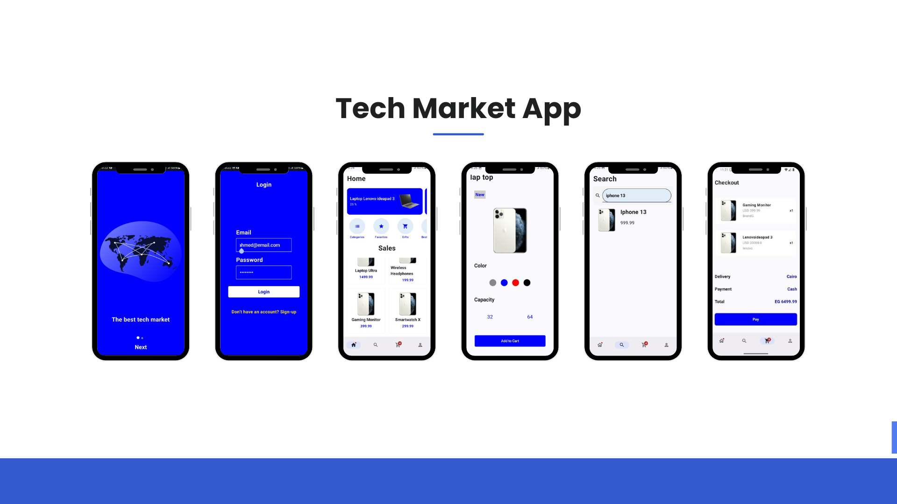

# 🛒 Tech Market App

Tech Market is a sleek and modern **e-commerce mobile application** built for Android using **Jetpack Compose** and **Supabase**. The app allows users to browse and purchase the latest technology products like phones, laptops, tablets, and accessories. Designed with an intuitive interface and powerful features to ensure a smooth and enjoyable shopping experience.



---

## ✨ Features

### 🏠 Home Screen
- Displays **featured products**, **latest offers**, and **top-rated items**.
- Category navigation (Phones, Laptops, Tablets, Accessories).
- Fast loading with optimized UI using Jetpack Compose.

### 🔍 Search Screen
- Powerful product search functionality.
- Instant filtering by **price**, **brand**, and **category**.
- Displays search results in grid layout with product image, title, and price.

### 👤 Profile Screen
- View and edit user profile information.
- View order history and saved addresses.
- Login/Logout using Firebase Authentication.

### 🛒 Add to Cart Screen
- Users can add products to cart from any screen.
- Adjust product quantity and see real-time price updates.
- Checkout summary with total cost and product details.

---


## 🔧 Technologies Used

- **Jetpack Compose** for modern declarative UI
- **Kotlin** as the programming language
- **Supabase** (Auth, store, Storage) for backend
- **Coil** for image loading
- **Navigation Component** for screen transitions
- **ViewModel + StateFlow** for reactive UI and state management

---

## 🛠️ Installation

1. Clone the repository:

```bash
git clone https://github.com/ahmedNaser7/Tech-Market-App.git
